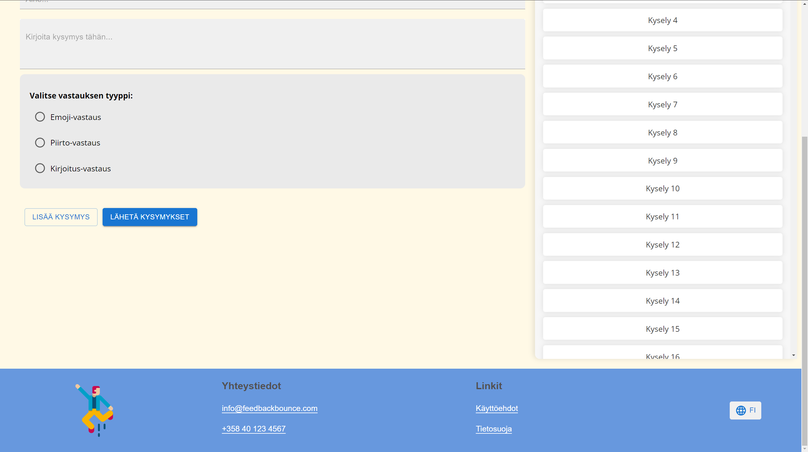
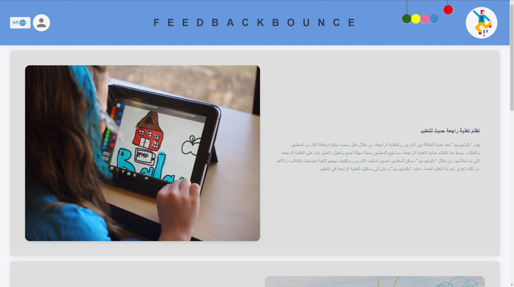
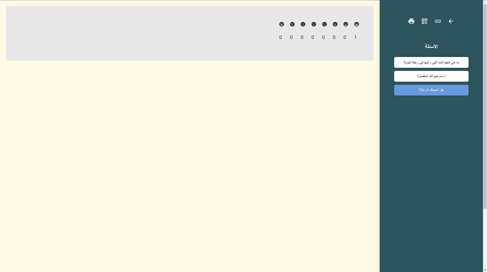

# FeedbackBounce - Loppudokumentti

Palautesovellus / Instance Course Feedback

**Ryhmän jäsenet** 
Adrian Gashi 
Yamir Haque 
Leo Härkönen 

---

Tieto- ja viestintätekniikka, TVT22K-O 
Ohjelmistotuotantoprojekti 2 (TX00CF84-3018) 
10.12.2023 

---

**Sisällysluettelo**

- [1. Johdanto](#1-johdanto)
- [2. Asiakkaan vaatimukset](#2-asiakkaan-vaatimukset)
  - [2.1. Tarve](#21-tarve)
  - [2.2. Toimintaidea](#22-toimintaidea)
- [3. Kehitysmenetelmät](#3-kehitysmenetelmät)
- [4. Järjestelmän suunnittelu ja arkkitehtuuri](#4-järjestelmän-suunnittelu-ja-arkkitehtuuri)
  - [4.1 Käyttäjäroolit ja käyttötapaukset](#41-käyttäjäroolit-ja-käyttötapaukset)
    - [4.1.1 Käyttötapauskaavio](#411-käyttötapauskaavio)
  - [4.2 Ohjelmiston tietomalli](#42-ohjelmiston-tietomalli)
    - [4.2.1 ER-kaavio](#421-er-kaavio)
    - [4.2.2 SQL-kaavio](#422-sql-kaavio)
    - [4.2.3 Tietokannan muutos](#423-tietokannan-muutos)
  - [4.3 Ohjelmiston rakenne](#43-ohjelmiston-rakenne)
    - [4.3.1 Luokkakaavio](#431-luokkakaavio)
    - [4.3.2 Pakkauskaavio](#432-pakkauskaavio)
    - [4.3.3 Sijoittelukaavio](#433-sijoittelukaavio)
  - [4.4 Ohjelmiston toiminta](#44-ohjelmiston-toiminta)
    - [4.4.1 Sekvenssikaavio](#441-sekvenssikaavio)
    - [4.4.2 Aktiviteettikaavio](#442-aktiviteettikaavio)
- [5. Käyttöliittymä](#5-käyttöliittymä)
  - [5.1. Käyttöliittymän rakenne](#51-käyttöliittymän-rakenne)
  - [5.2. Keskeiset näkymät ja toiminnot](#52-keskeiset-näkymät-ja-toiminnot)
    - [5.2.1. Etusivu](#521-etusivu)
    - [5.2.2. Tunnistautuminen](#522-tunnistautuminen)
    - [5.2.3. Kyselyjen hallinta](#523-kyselyjen-hallinta)
    - [5.2.4. Piirtämiskenttä](#524-piirtämiskenttä)
    - [5.2.5. Emojikenttä](#525-emojikenttä)
    - [5.2.6. Kirjoituskenttä](#526-kirjoituskenttä)
    - [5.2.7. Kiitossivu](#527-kiitossivu)
    - [5.2.8. Hallintosivusto](#528-hallintosivusto)
- [6. Lokalisointi](#6-lokalisointi)
  - [6.1. Lokalisoinnin Resurssit](#61-lokalisoinnin-resurssit)
  - [6.2. Lokalisoinnin Toteutus](#62-lokalisoinnin-toteutus)
  - [6.3. Tietokannan lokalisointi](#63-tietokannan-lokalisointi)
  - [6.4. Käyttöliittymän Lokalisointi](#64-käyttöliittymän-lokalisointi)
    - [6.4.1. Hallinnointipaneeli](#641-hallinnointipaneeli)
      - [Suomi](#suomi)
      - [Englanti](#englanti)
      - [Arabia](#arabia)
    - [6.4.2. Etusivu](#642-etusivu)
      - [Suomi](#suomi-1)
      - [Englanti](#englanti-1)
      - [Arabia](#arabia-1)
    - [6.4.3. Sisäänkirjautuminen](#643-sisäänkirjautuminen)
      - [Suomi](#suomi-2)
      - [Englanti](#englanti-2)
      - [Arabia](#arabia-2)
    - [6.4.4. Sessio](#644-sessio)
      - [Suomi](#suomi-3)
      - [Englanti](#englanti-3)
      - [Arabia](#arabia-3)
    - [6.4.5. Tulokset](#645-tulokset)
      - [Suomi](#suomi-4)
      - [Englanti](#englanti-4)
      - [Arabia](#arabia-4)
    - [6.4.6. Rekisteröityminen](#646-rekisteröityminen)
      - [Suomi](#suomi-5)
      - [Englanti](#englanti-5)
      - [Arabia](#arabia-5)
    - [6.4.7. Kiitos-sivu](#647-kiitos-sivu)
      - [Suomi](#suomi-6)
      - [Englanti](#englanti-6)
      - [Arabia](#arabia-6)
- [7. Käyttöönotto](#7-käyttöönotto)
  - [7.1. Vite](#71-vite)
  - [7.2. React](#72-react)
  - [7.3. JavaScript / Nodejs](#73-javascript--nodejs)
  - [7.4. CSS](#74-css)
  - [7.5. Jenkins](#75-jenkins)
  - [7.6. Vitest](#76-vitest)
  - [7.7. Playwright](#77-playwright)
  - [7.8. Sqlite](#78-sqlite)
  - [7.9. Express.js](#79-expressjs)
  - [7.10. Eslint](#710-eslint)
  - [7.11. Prettier](#711-prettier)
  - [7.12. MUI](#712-mui)
- [8. Järjestelmän testaus](#8-järjestelmän-testaus)
  - [8.1. Yksikkötestaus](#81-yksikkötestaus)
  - [8.2. Käyttöliittymätestaus](#82-käyttöliittymätestaus)
    - [8.2.1. Kyselyyn vastaaminen](#821-kyselyyn-vastaaminen)
  - [8.2.2. Kielen vaihtaminen](#822-kielen-vaihtaminen)
  - [8.2.3. Tunnistautuminen](#823-tunnistautuminen)
  - [8.2.4. Kyselyn luominen](#824-kyselyn-luominen)
- [9. Muutokset ja kehitysehdotukset](#9-muutokset-ja-kehitysehdotukset)
  - [9.1. Muutokset alkuperäiseen visioon](#91-muutokset-alkuperäiseen-visioon)
    - [9.1.1 Tekstistä puheeksi](#911-tekstistä-puheeksi)
    - [9.1.2 Ääniviesti](#912-ääniviesti)
    - [9.1.3 Integrointi](#913-integrointi)
    - [9.1.3 Viestintäkanavat](#913-viestintäkanavat)
  - [9.2. Mahdolliset tulevat kehitysaskeleet](#92-mahdolliset-tulevat-kehitysaskeleet)
    - [9.2.1 Palauteanalyysi](#921-palauteanalyysi)
    - [9.2.2 Käyttöliittymän parantaminen](#922-käyttöliittymän-parantaminen)
    - [9.2.3 Anonyymiuden valinta kyselyä luodessa](#923-anonyymiuden-valinta-kyselyä-luodessa)
    - [9.2.4 Pelillistäminen](#924-pelillistäminen)
- [10. Yhteenveto](#10-yhteenveto)
- [11. Liitteet](#11-liitteet)
  - [11.1. Trello](#111-trello)
  - [11.2. GitHub](#112-github)
  - [11.2. Postman](#112-postman)

### 1. Johdanto

Nykyajan koulutuksessa on yhä tärkeämpää ymmärtää oppilaiden tarpeet ja
kokemukset. Opetus ei ole pelkästään tiedon jakamista, vaan keskeinen osa on
myös vuorovaikutus oppilaiden kanssa ja heidän kokemustensa huomioiminen.
Palautteiden kerääminen on keskeinen työkalu opettajille ympäri maailmaa.

Palautepomppu on verkkosovellus, joka mahdollistaa alakoululaisille helpon ja
monipuolisen tavan antaa palautetta opettajilleen esimerkiksi oppitunneista, eri
aktiviteeteista ja muista kouluun tai oppimiseen liittyvistä asioista. Sovelluksen
kautta oppilaat voivat välittää tuntemuksiaan ja ajatuksiaan käyttäen erilaisia
ilmaisutapoja kuten emojien, piirtämisen tai kirjoituksen muodossa.

Verkkosovellus on kehitetty vastaamaan tähän tarpeeseen erityisesti alakoulu ympäristössä. Alakoululaiset ovat erityinen ryhmä, sillä heidän kykynsä ilmaista itseään ja antaa palautetta eroaa huomattavasti vanhemmista oppilaista. Tästä syystä kehitimme sovelluksen, joka on suunniteltu erityisesti heidän tarpeitaan huomioiden.

### 2. Asiakkaan vaatimukset

#### 2.1. Tarve

Projektin "FeedbackBounce" keskeinen tarve on nykyaikaisen koulutuksen vaatimuksen ymmärtäminen, erityisesti oppilaiden tarpeiden ja kokemusten huomioiminen. Opetus ei ole vain tiedon jakamista, vaan keskeistä on vuorovaikutus oppilaiden kanssa ja heidän kokemustensa huomioiminen. Palautteen kerääminen on tärkeää opettajille eri puolilla maailmaa.

#### 2.2. Toimintaidea

FeedbackBounce on verkkosovellus, joka mahdollistaa alakoululaisille helpon ja monipuolisen tavan antaa palautetta opettajilleen. Oppilaat voivat välittää tuntemuksiaan ja ajatuksiaan eri ilmaisutapojen, kuten emojien, piirtämisen ja kirjoituksen avulla. Sovellus on kehitetty erityisesti alakouluympäristöön, ottaen huomioon nuorempien oppilaiden erilaiset kyvyt ilmaista itseään ja antaa palautetta.

### 3. Kehitysmenetelmät

Projektimme on toteutettu agile scrum -menetelmällä. Jokainen tiimin jäsen on toiminut scrum masterina vuorollaan, yhteensä kahden sprintin ajan. Työskentelyssämme olemme hyödyntäneet Trelloa projektinhallinnan työkaluna, joka on auttanut meitä pysymään aikataulussa ja organisoimaan tehtävämme tehokkaasti.

### 4. Järjestelmän suunnittelu ja arkkitehtuuri

#### 4.1 Käyttäjäroolit ja käyttötapaukset

##### 4.1.1 Käyttötapauskaavio

*Kuva 1: aktiviteettikaavio*

Käyttötapauskaavion kuvaus

* Pääkäyttäjällä on ylin oikeus hallita sovelluksen käyttöoikeuksia. Hän voi lisätä, muuttaa ja poistaa muita käyttäjiä (opettajia) sekä määrittää heidän oikeutensa.
* Opettaja luo kyselyitä, valitsee niille teemat ja tarkastelee kyselyiden tuloksia. Opettajalla on oikeus nähdä vain omiin kyselyihin liittyvät tiedot.
* Oppilas vastaa opettajan luomiin kyselyihin, joko lukemalla QR-koodin puhelimella tai siirtymällä URL-osoitteeseen tietokoneella.

Käyttäjäroolit ja Käyttötapaukset

Käyttäjätilien hallinta (Opettaja)

* Opettaja voi luoda, muokata ja poistaa oppilaiden käyttäjätilejä.
* Opettaja voi tarkastella oppilaiden käyttäjätilien tietoja.

Palautteiden analysointi (Opettaja)

* Opettaja voi analysoida oppilaiden antamia palautteita käyttäen erilaisia työkaluja, kuten sanapilviä ja tunnetilan analysointia.
* Opettaja voi vertailla palautteita eri aikaväleiltä ja ryhmiltä.

Palautehistorian tarkastelu (Oppilas)

* Oppilas voi tarkastella aiemmin antamiaan palautteita ja niiden tilastoja.
* Oppilas voi nähdä, miten hänen palautteensa ovat vaikuttaneet koulun toimintaan.

Palautteen jakaminen ja yhteistyö (Opettajat)

* Opettajat voivat jakaa palautteita keskenään ja tehdä yhteistyötä parantamaan opetusmenetelmiä.
* Opettajat voivat luoda yhteisiä raportteja ja keskustella niistä virtuaalisissa kokouksissa.

#### 4.2 Ohjelmiston tietomalli

##### 4.2.1 ER-kaavio

*Kuva 2: ER-kaavio*

ER-kaavion kuvaus

1. Entiteetti: Opettaja

Kuvaus: Tämä entiteetti kuvaa koulun opettajaa, joka voi luoda useita sessioita.

Attribuutit:

* opettaja_id (PK): Opettajan yksilöllinen tunniste.
* etunimi: Opettajan etunimi.
* sukunimi: Opettajan sukunimi.
* sposti: Opettajan sähköpostiosoite.
* salasana: Opettajan salasana (salattu).
* liittynyt: Päivämäärä, jolloin opettaja rekisteröityi järjestelmään.

2. Entiteetti: Sessio

Kuvaus: Tämä entiteetti kuvaa tiettyä palautteenantosessiota, jonka opettaja on luonut. Sessio voi koostua useista kysymyksistä.

Attribuutit:

* sessio_id (PK): Session yksilöllinen tunniste.
* ajankohta: Session luontipäivämäärä.

3. Entiteetti: Kysymys

Kuvaus: Tämä entiteetti kuvaa yksittäistä kysymystä jossain tietyssä sessiossa. Jokaiseen kysymykseen voidaan antaa useita vastauksia.

Attribuutit:

* kysymys_id (PK): Kysymyksen yksilöllinen tunniste.
* viesti: Kysymyksen sisältö.

4. Entiteetti: Vastaus

Kuvaus: Tämä entiteetti kuvaa yksittäistä vastausta johonkin kysymykseen.

Attribuutit:

* vastaus_id (PK): Vastauksen yksilöllinen tunniste.
* vastaaja: Vastaajan tunniste, joka ei kuitenkaan ole yksilöllinen, UUID.
* viesti: Vastauksen sisältö.
* ajankohta: Aikaleima, jolloin vastaus annettiin.

5. Entiteetti: Pääkäyttäjä

Kuvaus: Järjestelmän pääkäyttäjä, jolla on ylempiä oikeuksia mutta ei yhdisty muihin entiteetteihin.

Attribuutit:

* master_id (PK): Pääkäyttäjän yksilöllinen tunniste.
* sposti: Pääkäyttäjän sähköpostiosoite.
* salasana: Pääkäyttäjän salasana (salattu).

Yhteystyypit (Relationships):

1. Luo (Opettaja - Sessio)
Yhden suhde moneen -yhteys. Yksi opettaja voi luoda useita sessioita, mutta yksi sessio liittyy vain yhteen opettajaan.

2. Koostuu (Sessio - Kysymys)
Yhden suhde moneen -yhteys. Yksi sessio voi koostua useista kysymyksistä, mutta yksi kysymys kuuluu vain yhteen sessioon.

3. Saa (Kysymys - Vastaus)
Yhden suhde moneen -yhteys. Yksi kysymys voi saada useita vastauksia, mutta yksi vastaus liittyy vain yhteen kysymykseen

##### 4.2.2 SQL-kaavio

*Kuva 3: SQL-kaavio*

##### 4.2.3 Tietokannan muutos

Playwright-testien kanssa oli haasteita, koska koulun palvelimella oleva tietokanta vaati VPN-yhteyttä. Tämän ongelman ratkaisemiseksi siirsimme tietokannan pois palvelimelta ja käytimme sen sijaan SQLitea.

#### 4.3 Ohjelmiston rakenne

##### 4.3.1 Luokkakaavio

*Kuva 4: Luokkakaavio*

Luokkakaavion kuvaus

1. Sivut ja komponentit:

App: Pääkomponentti, joka reitittää eri sivuille URL-osoitteen mukaan.

Landing: Sovelluksen pääsivu, jota käytetään sovelluksen ominaisuuksien esittelyyn. Tämän sivun kautta pääsee kirjautumissivulle.

SignIn ja SignUp: Sivut, jotka mahdollistavat opettajan ja pääkäyttäjän kirjautumisen ja rekisteröitymisen sovellukseen.

Dashboard: Opettajan päänäkymä kirjautumisen jälkeen, josta hän voi tarkastella ja hallinnoida palautteita.

Feedback: Oppilaalle näytettävä sivu, jonka kautta palaute annetaan.

EmojiFeedback, DrawFeedback, WriteFeedback, ReadFeedback: Alakomponentteja, jota Feedback-sivu käyttää

Footer: Landing-sivun alapalkissa näkyvä komponentti.

TeacherQuestion: Komponentti, joka mahdollistaa opettajille kysymysten luomisen.

2. Suhteet:

Feedback komponentti käyttää EmojiFeedback, DrawFeedback, WriteFeedback ja ReadFeedback komponentteja.

Landing-sivu käyttää Footer-komponenttia.

SignIn- ja SignUp-sivut käyttää Copyright-komponenttia

3. Attribuutit ja Operaatiot:

Kaaviossa näkyvät komponenttien metodit esittävät sisältöä visuaalisesti ja toteuttavat lomakkeiden täyttöön liittyviä operaatioita.

Attribuutit ovat pääosin komponenttien ja sivujen tilojen hallintaan liittyviä yksityiskohtia.

##### 4.3.2 Pakkauskaavio

*Kuva 5: Pakkauskaavio*

Pakkauskaavion kuvaus

Sivut koostuvat komponenteista ja ne tekevät API-pyyntöjä.

Komponentit ovat pieniä elementtejä, joista käyttöliittymä koostuu.

API käyttää tietokanta pakkauksen funktioita tiedon välittämiseen.

Tietokantapakkaus sisältää funktioita tietokannan käyttämiseen.

Pakkaukset Utils ja Vakiot sisältävät yleiskäyttöisiä funktioita ja muuttujia, joita voidaan käyttää eri puolella sovellusta.

##### 4.3.3 Sijoittelukaavio

*Kuva 6: Sijoittelukaavio*

Sijoittelukaavion kuvaus

Tietokanta: MariaDB -relaatiotietokantajärjestelmällä toteutettu tietokantaratkaisu.

Backend: Palvelin, jossa REST API on toteutettu Node.js ympäristössä. API käyttää tietokantaa TCP/IP-yhteydellä.

Frontend hostaus: Isännöi asiakkaalle toimitettavia web-tiedostoja (HTML, CSS, JS, kuvat). Asiakkaalle toimitetut tiedostot kutsuvat palvelinpuolen API:a http-yhteydellä.

Asiakas: Loppukäyttäjä, joka pyytää web-tiedostoja https-yhteydellä.

#### 4.4 Ohjelmiston toiminta

##### 4.4.1 Sekvenssikaavio

*Kuva 7: Sekvenssikaavio*

Sekvenssikaavion kuvaus

1. Käyttäjä aloittaa kirjautumisen.

2. SignIn -komponentti hallinnoi kirjautumisprosessia.

Selaimen tallennustilasta tarkistetaan, onko käyttäjällä jo oikeudet.

Jos kirjautumistietoja ei ole tallessa, luodaan pyyntö tietokantaan.

Tietokannan vastaus tallennetaan selaimeen.

Selaimesta tarkistetaan uudestaan kirjautumisstatus.

Tieto välitetään SignIn -komponentille.

3. Käyttäjä on kirjautuneena sisään.

##### 4.4.2 Aktiviteettikaavio

*Kuva 8: Aktiviteettikaavio*

Aktiviteettikaavion kuvaus

1. Opettaja luo kyselyn. Kysely voi sisältää useamman kysymyksen.

2. Opettaja lisää kysymyksen kyselyyn.

3. Opettaja valitsee vastaustyypin, jolla oppilaat tulevat vastaamaan. Vastaustyyppejä on kolme: piirros, kirjoitus ja emoji.

4. Opettaja kirjoittaa itse kysymyksen.

5. Opettaja valitsee teeman kysymykselle.

6. Opettaja valitsee lisätäänkö kyselyyn kysymyksiä, jos hän lisää kysymyksen palataan kohtaan 2.

7. Opettaja julkaisee kyselyn.

8. Opettaja pyytää oppilaitaan vastaamaan kyselyyn.

9. Riippuen käyttääkö oppilas tietokonetta vai matkapuhelinta, navigoi hän kyselyyn joko käyttämällä URL-osoitetta tai QR-koodia.

10. Oppilas täyttää kyselyn vastaten kaikkiin kysymyksiin.

11. Oppilas lähettää kyselyn vastattuaan kysymyksiin.

12. Opettaja tarkastelee vastauksia sen jälkeen, kun oppilaat ovat vastanneet kyselyyn.

### 5. Käyttöliittymä

#### 5.1. Käyttöliittymän rakenne

#### 5.2. Keskeiset näkymät ja toiminnot

Palautepomppu-sovellus erottuu monipuolisuudellaan. Eri palauteaiheille tarkoitetut teemat tekevät käytöstä sujuvaa. Emoji-, kirjoitus- ja piirtämiskenttä tarjoavat alakoululaisille luontevia tapoja ilmaista itseään. Sovelluksessa on
myös tehokas hallinnointipaneeli opettajille, mahdollistaen kyselyjen hallinnan ja palautteiden tarkastelun.

##### 5.2.1. Etusivu

Etusivu keskittyy sovelluksen esittelyyn ja markkinointiin. Esittelyn lisäksi löytyy
kirjaudu-kuvake sekä yhteystiedot ylä- ja alapalkeista vastaavasti.

*Kuva 9. Etusivun yläosa.*

*Kuva 10. Etusivun keskiosa.*

*Kuva 11. Etusivun alaosa.*

##### 5.2.2. Tunnistautuminen

Sovelluksen opettajille ja pääkäyttäjille tarkoitetut sivut vaativat tunnistautumista. Tunnistautuminen koostuu kahdesta sivusta: rekisteröinti sekä kirjautuminen. Rekisteröintisivulla opettaja voi luoda itselleen käyttäjän, pääkäyttäjän luontiin ei ole erillistä sivua tietoturvan takia.

*Kuva 12. Rekisteröintilomake.*

Kirjautumissivulla sekä opettaja että pääkäyttäjä voivat kirjautua ja päästä
omille sivuilleen.

*Kuva 13. Kirjautumislomake.*

##### 5.2.3. Kyselyjen hallinta

Kyselyhallinta vaatii opettajana kirjautumisen. Tämä näkymä sisältää uuden
kyselyn luonnin sekä aiempien kyselyiden listauksen.

*Kuva 14. Kyselyhallinnointi.*

Aiempia kyselyitä painamalla listassa pääsee uuteen näkymään josta
vastauksia pystyy tarkistamaan kysymyskohtaisesti.

*Kuva 15. Kyselyn kysymyskohtainen palautenäkymä.*

##### 5.2.4. Piirtämiskenttä

Tämä toiminto mahdollistaa oppilaiden palautteen antamisen piirrosten kautta,
mikä on erityisen tehokas nuoremmille oppilaille, jotka saattavat kokea sen
luontevammaksi ja hauskemmaksi tavaksi antaa palautetta.

*Kuva 16. Piirtämiskenttä palautteenanto sivulla.*

##### 5.2.5. Emojikenttä

Tämä toiminto sallii oppilaiden antaa palautetta käyttämällä emojeja. Se tarjoaa
nopean ja visuaalisen tavan ilmaista tunteita ja mielipiteitä, erityisesti niille
oppilaille, jotka saattavat käyttää mieluummin kuvallista ilmaisutapaa.

*Kuva 17. Emoji palautteenanto sivulla.*

##### 5.2.6. Kirjoituskenttä

Kirjoituskenttä antaa oppilaille alustan ilmaista itseään sanallisesti. Se on
erityisen hyödyllinen silloin, kun oppilaat haluavat jakaa yksityiskohtaisempaa
palautetta tai kertoa kokemuksistaan vapaamuotoisesti.

*Kuva 18. Kirjoitus palautteenanto sivulla.*

##### 5.2.7. Kiitossivu

Kun oppilas on täyttänyt ja lähettänyt kyselyn, heidät ohjataan Kiitos-sivulle.
Tämä sivusto on suunniteltu erityisesti lapsia ajatellen, ja se sisältää
lapsenmielisen ja värikkään taustakuvituksen, joka tekee palautteen
antamisesta mielekkäämmän ja palkitsevamman kokemuksen oppilaalle.
Taustan tarkoitus on luoda myönteinen ja kannustava tunnelma, joka rohkaisee
oppilaita osallistumaan aktiivisesti palauteprosessiin tulevaisuudessakin.

*Kuva 19. Palautteen jälkeen tuleva kiitos-sivu*

##### 5.2.8. Hallintosivusto

Hallinnoijalle tarjotaan työkalut käyttäjien tarkasteluun ja hallintaan. He voivat
tarkastella rekisteröityneiden käyttäjien sähköposteja sekä tarvittaessa poistaa
käyttäjiä järjestelmästä.

*Kuva 20. Pääkäyttäjän hallinnointipaneeli.*

### 6. Lokalisointi

Kielivalinnat perustuen tarkkaan tutkimukseen: Olemme tiiviisti yhteistyössä tiimimme kanssa keskustelleet ja valinneet potentiaaliset kielet lokalisointia varten. Tämä päätös perustuu huolellisesti suoritettuun taustatutkimukseen sekä data-analyysiin, jossa hyödynsimme lähteinä muun muassa Ylekoulukonetta ja Tilastokeskuksen tietoja. Tämä analyysi auttoi meitä ymmärtämään kohderyhmämme kielellisiä tarpeita ja preferenssejä paremmin.

Sisällön räätälöinti alakoululaisten tarpeisiin: Olemme suunnitelleet sisällön lokalisaation huomioiden erityisesti kielellisen soveltuvuuden alakoululaisille. Tämä sisältää kielen yksinkertaistamista ja kulttuurisesti relevanttien esimerkkien käyttöä, varmistaaksemme, että materiaali on sekä ymmärrettävää että kiinnostavaa nuoremmalle yleisölle.

Teknisen lokalisaation suunnittelun läpikäynti: Olemme myös käyneet läpi ja suunnitelleet teknisen lokalisaation yksityiskohtia. Tämä prosessi sisältää muun muassa kielikohtaisten käyttöliittymien suunnittelun ja toteutuksen, kieliversioiden testaamisen, sekä varmistamisen, että tekniset ra

#### 6.1. Lokalisoinnin Resurssit

Tekstien kääntämisessä käytimme Google kääntäjää sekä muita AI-pohjaisia
käännöstyökaluja. Tämä on ollut kustannustehokas ja nopea ratkaisu, mutta tärkeää on
varmistaa käännösten laatu ja kulttuurinen relevanssi, erityisesti kun käännetään
monimutkaisia tai erikoisalojen tekstejä kuten meidän kohdalla Arabian kieli.

Kun kehitetään sovellus, joka on tarkoitettu julkaisuun laajemmalle yleisölle, niin silloin on
tärkeää käyttää ammattikääntäjie tekstien lokalisoimiseen. Näin voidaan varmistaa, että
käännökset ovat paitsi kielellisesti tarkkoja, myös kulttuurisesti sopivia ja ymmärrettäviä
kohdeyleisölle.

Tutkimme erilaisia sisällönhallintajärjestelmiä käännösten hallintaan. Locize vaikutti
toimivalta ratkaisulta, mutta päädyimme lopulta pitämään käännökset JSON-tiedostoina
samassa repositiossa lähdekoodin kanssa kustannus ja aikarajoitteiden vuoksi.

Laadittu Excel-taulukkoa käännöksille ja annettu niille uniikit tunnisteet. Siirryimme myöhemmin käyttämään JSON-tiedostoja paremman yhteentoimivuuden lähdekoodin kanssa.

*Kuva 21. Lokalisointitaulukko*

#### 6.2. Lokalisoinnin Toteutus

Otettu käyttöön i18next-kirjasto käännösten hallintaan.

* Käännetty tekstit ja varmistettu niiden toimivuus eri sivuilla.
* Luotu translation.json tiedostot suomen, englannin ja arabian kielille.
* Testattu sovelluksen toimintaa arabian kielellä, mukaan lukien käyttöliittymän peilaus

#### 6.3. Tietokannan lokalisointi

Käyttöliittymän Tekstit Tietokannassa: Lokalisointi toteutetaan luomalla jokaiselle kielelle oma taulu, nimeltään `i18n_<kieli>`, esimerkiksi `i18n_en_US`. Taulut sisältävät kolme saraketta: `id`, `key` ja `value`. `Id` viittaa käännöksen avaintauluun, key on käännöksen avain, ja value itse käännösteksti. Tämä mahdollistaa sisällön reaaliaikaisen päivittymisen eri kielille.

Kielen Merkitseminen Käyttäjän Syötteeseen: Käyttäjän syötteitä sisältäviin tauluihin lisätään uusi sarake, language, joka merkitsee käyttäjän valitseman kielen (esim. en_US). Tämä mahdollistaa sisällön automaattisen kääntämisen muille kielille käyttäen esimerkiksi Google Translate API:ta ja suodattaa sisältöä käyttäjän kielivalinnan mukaan.

Tietokannan suunnitteludokumentti: [docs/database-i18n-plan.md](../docs/database-i18n-plan.md)

Vaihtoehtoinen suunnitteludokumentti: [docs/database-i18n-plan-2.pdf](../docs/database-i18n-plan-2.pdf)

#### 6.4. Käyttöliittymän Lokalisointi

Projektissamme "FeedbackBounce" käytimme i18next ja react-i18next -kirjastoja sovelluksemme lokalisointiin. Nämä kirjastot tarjoavat kattavat työkalut monikielisen sisällön hallintaan ja sovelluksen kielivaihtoehdon toteuttamiseen. Tässä selostuksessa kuvataan näiden kirjastojen rooli ja käyttö projektissamme.

i18next on tehokas kansainvälistämiskirjasto, joka mahdollistaa käännöstiedostojen helpon hallinnan ja dynaamisen kielenvaihdon sovelluksessa. Se tukee monia eri kieliä ja mahdollistaa käännösten lataamisen lennossa, mikä tekee sovelluksestamme joustavan ja skaalautuvan eri kielivaihtoehtojen suhteen. i18next tukee useita eri latausstrategioita käännöstiedostoille, kuten etäpalvelimelta lataamista tai staattisten tiedostojen käyttöä. Tämä mahdollistaa käännöstiedostojen tehokkaan hallinnan ja päivittämisen.

react-i18next on i18next-kirjaston integraatio React-sovelluksiin. Se tarjoaa React-komponentteja ja koukkuja (hooks), joiden avulla käännökset voidaan tuoda suoraan React-komponentteihin. Tämä tekee kielenvaihdon toteuttamisen React-sovelluksissa erittäin sujuvaksi. react-i18nextin käyttö mahdollistaa käännösten dynaamisen päivittämisen ilman, että sivua tarvitsee ladata uudelleen. Tämä parantaa käyttäjäkokemusta, sillä kielivaihtoehto voidaan vaihtaa lennossa ilman katkoksia sovelluksen käytössä.

Käytännössä, projektissamme käännöstiedostot on määritelty JSON-muodossa, joka mahdollistaa helpon muokkauksen ja ylläpidon. Nämä tiedostot sisältävät avain-arvo -pareja, joissa avain edustaa tekstikentän tunnistetta ja arvo itse käännöstä. Sovelluksessa käytetään react-i18nextin tarjoamia koukkuja, kuten useTranslation, joiden avulla käännökset voidaan liittää suoraan React-komponentteihin.

Lokalisointiprosessimme avulla voimme tarjota sovelluksen käyttäjille intuitiivisen ja kulttuurisesti relevantin käyttökokemuksen eri kielillä. Tämä ei ainoastaan paranna sovelluksen saavutettavuutta ja käyttäjäystävällisyyttä, vaan myös tukee koulutuksen inklusiivisuutta ja monikielisyyttä.

##### 6.4.1. Hallinnointipaneeli

###### Suomi

*Kuva 22: Hallinnointipaneelin ensimmäinen osa suomenkielisenä.*

*Kuva 23: Hallinnointipaneelin jatko suomenkielisenä.*

###### Englanti

*Kuva 24: Hallinnointipaneelin ensimmäinen osa englanninkielisenä.*

*Kuva 25: Hallinnointipaneelin jatko englanninkielisenä.*

###### Arabia

*Kuva 26: Hallinnointipaneelin ensimmäinen osa arabiankielisenä.*

*Kuva 27: Hallinnointipaneelin jatko arabiankielisenä.*

##### 6.4.2. Etusivu

###### Suomi

*Kuva 28: Etusivun ensimmäinen osa suomenkielisenä.*

*Kuva 29: Etusivun jatko suomenkielisenä.*

*Kuva 30: Etusivun kolmas osa suomenkielisenä.*

###### Englanti

*Kuva 31: Etusivun ensimmäinen osa englanninkielisenä.*

*Kuva 32: Etusivun jatko englanninkielisenä.*

*Kuva 33: Etusivun kolmas osa englanninkielisenä.*

###### Arabia

*Kuva 34: Etusivun ensimmäinen osa arabiankielisenä.*

*Kuva 35: Etusivun jatko arabiankielisenä.*

*Kuva 36: Etusivun kolmas osa arabiankielisenä.*

##### 6.4.3. Sisäänkirjautuminen

###### Suomi

*Kuva 37: Sisäänkirjautumissivun suomenkielinen versio.*

###### Englanti

*Kuva 38: Sisäänkirjautumissivun englanninkielinen versio.*

###### Arabia

*Kuva 39: Sisäänkirjautumissivun arabiankielinen versio.*

##### 6.4.4. Sessio

###### Suomi

*Kuva 40: Sessiosivun ensimmäinen osa suomenkielisenä.*

*Kuva 41: Sessiosivun toinen osa suomenkielisenä.*

*Kuva 42: Sessiosivun kolmas osa suomenkielisenä.*

###### Englanti

*Kuva 43: Sessiosivun ensimmäinen osa englanninkielisenä.*

*Kuva 44: Sessiosivun toinen osa englanninkielisenä.*

*Kuva 45: Sessiosivun kolmas osa englanninkielisenä.*

###### Arabia

*Kuva 46: Sessiosivun ensimmäinen osa arabiankielisenä.*

*Kuva 47: Sessiosivun toinen osa arabiankielisenä.*

*Kuva 48: Sessiosivun kolmas osa arabiankielisenä.*

##### 6.4.5. Tulokset

###### Suomi

*Kuva 49: Tulossivun ensimmäinen osa suomenkielisenä.*

*Kuva 50: Tulossivun toinen osa suomenkielisenä.*

*Kuva 51: Tulossivun kolmas osa suomenkielisenä.*

###### Englanti

*Kuva 52: Tulossivun ensimmäinen osa englanninkielisenä.*

*Kuva 53: Tulossivun toinen osa englanninkielisenä.*

*Kuva 54: Tulossivun kolmas osa englanninkielisenä.*

###### Arabia

*Kuva 55: Tulossivun ensimmäinen osa arabiankielisenä.*

*Kuva 56: Tulossivun toinen osa arabiankielisenä.*

*Kuva 57: Tulossivun kolmas osa arabiankielisenä.*

##### 6.4.6. Rekisteröityminen

###### Suomi

*Kuva 58: Rekisteröitymissivun suomenkielinen versio.*

###### Englanti

*Kuva 59: Rekisteröitymissivun englanninkielinen versio.*

###### Arabia

*Kuva 60: Rekisteröitymissivun arabiankielinen versio.*

##### 6.4.7. Kiitos-sivu

###### Suomi

*Kuva 61: Kiitos-sivun suomenkielinen versio.*

###### Englanti

*Kuva 62: Kiitos-sivun englanninkielinen versio.*

###### Arabia

*Kuva 63: Kiitos-sivun arabiankielinen versio.*

### 7. Käyttöönotto

Projektissa käytimme useita teknologioita ja työkaluja, jotka yhdessä muodostiva tehokkaan ja joustavan kehitysympäristön. Alla on yhteenveto näistä teknologioista ja niiden roolista projektissamme:

#### 7.1. Vite

Sovelluksen rakentamiseen ja kehittämiseen käytimme Viteä, joka on nykyaikainen frontend-kehitystyökalu. Se tarjosi nopean hot-reload-toiminnon ja tehokkaan moduulien käsittelyn.

Vite on moderni etupään rakennustyökalu, joka tarjoaa nopeamman ja tehokkaamman kehityskokemuksen. Vite hyödyntää ES-moduulien tuomaa nopeutta ja tarjoaa nopeaa käynnistystä sekä päivityksiä.

#### 7.2. React

Käytimme Reactia käyttöliittymän luomiseen. Se on suosittu JavaScript-kirjasto dynaamisten ja responsiivisten web-sovellusten kehittämiseen. Reactin komponenttipohjainen lähestymistapa mahdollisti modulaarisen ja helosti ylläpidettävän koodin.

#### 7.3. JavaScript / Nodejs

JavaScript toimi projektimme pääkielenä, ja Node.js tarjosi runtime-ympäristön palvelinpuolen kehitykselle. Tämä mahdollisti joustavan ja tehokkaan kehityksen.

JavaScript on dynaaminen ohjelmointikieli, jota käytetään laajalti verkkosivujen etupään kehityksessä. Node.js on JavaScriptin ympäristö, joka mahdollistaa JavaScript-koodin suorittamisen palvelinpuolella.

#### 7.4. CSS

Tyylien määrittelyyn ja käyttöliittymän ulkoasun hallintaan käytimme CSS:ää. Se mahdollisti visuaalisesti houkuttelevan ja käyttäjäystävällisen käyttöliittymän luomisen.

Cascading Style Sheets, tyylien määrittelykieli verkkosivuille. CSS:n avulla määritellään, miten HTML-elementit näytetään selaimissa.

#### 7.5. Jenkins

Jenkinsia hyödynsimme jatkuvan integraation ja jatkuvan toimituksen (CI/CD) prosessien automatisoinnissa. Sen avulla varmisitmme koodin laadun ja nopeutuimme kehityskerroksia.

Jenkins on avoin lähdekoodin automaatioalusta, jota voidaan käyttää jatkuvassa integraatiossa ja jatkuvassa toimituksessa (CI/CD) ohjelmistokehityksessä.

#### 7.6. Vitest

Testaukseen käytimme Vitestiä, joka on nopea ja kevyt testauskehyksenä erityisesti Viten kanssa käytettäväksi suunniteltu. Sen avulla varmistimme sovelluksemme luotettavuuden ja laadun.

#### 7.7. Playwright

Automaattisten selainpohjaisten testien suorittamiseen käytimme Playwrightia. Se mahdollisti selainympäristössä toimivien sovellusten tehokkaan ja luotettavan testaamisen.

Playwright on automaatioalusta selainpohjaisten sovellusten testaamiseen. Sen avulla voidaan automatisoida selaimen toimintaa monissa eri ympäristöissä.

#### 7.8. Sqlite

SQLite on kevyt, levyperustainen tietokanta, jota käytimme pysyvän tiedon tallennukseen. Käytimme aluksi Metropolian MariaDB:tä, mutta siirryimme myöhemmin SQLiteen, koska se oli helpompi käyttää testauksen kanssa.

#### 7.9. Express.js

Palvelinpuolen API:n kehityksessä hyödynsimme Express.js:ää, joka on minimalistinen ja joustava Node.js-websovelluskehys. Se helpotti sovelluksemme REST API:n luomisessa ja ylläpidossa.

#### 7.10. Eslint

Työkalu JavaScript-koodin staattiseen analyysiin, joka auttoi meitä tunnistamaan virheitä ja noudattamaan yhtenäisiä koodausstandardeja.

#### 7.11. Prettier

Koodin muotoilutyökalu, joka auttoi meitä ylläpitämään yhtenäistä koodityyliä projektissa ja vähentää "taistelut" oikeasta formatoinnista versionhallinnassa.

#### 7.12. MUI

Käyttöliittymäkomponenttien ja ikonien osalta käytimme MUI:ta (entinen Material-UI). Se tarjosi valmiita, tyylikkäitä ja helposti muokattavia komponentteja, jotka nopeuttivat kehitystyötä.

### 8. Järjestelmän testaus

#### 8.1. Yksikkötestaus

Käytimme yksikkötestaukseen Vitest-kirjastoa. Yksikkötestauksessa testasimme pelkästään sovelluksen REST API:a, koska emme koenneet että laajemmasta yksikkötestauksesta olisi hyötyä sovelluksessamme. Testit ovat suoritettavissa komennolla `npm run test:unit`.

#### 8.2. Käyttöliittymätestaus

Käyttöliittymätestauksessa käytimme Playwright-kirjastoa. Käyttöliittymätestauksessa testasimme sovelluksen käyttöliittymän ominaisuuksia. Testit ovat suoritettavissa komennolla `npm run test:e2e`.

##### 8.2.1. Kyselyyn vastaaminen

Tämm testitapaus on suunniteltu web-sovelluksen kyselyvastausprosessin testaamiseen
oppilaan nakökulmasta. Testissä varmistetaan, etta opiskelija voi käyttää
kyselyjärjestelmää ja vastata monenlaisiin kysymyksiin, kuten kirjoitettuihin
kysymyksiin, piirustuskysymyksiin ja emoji-kysymyksiin. Kaikki vaiheet testattiin ja
suurin osa sai "Pass"-arvion, lukuun ottamatta piirrostyökalua, joka ei toiminut
WebKit-selaimella

#### 8.2.2. Kielen vaihtaminen

Tama testitapaus keskittyy web-sovelluksen lokalisointiin ja kielenvaihto-
ominaisuuksiin. Testaaja vaihtaa kieltä kolmen eri vaihtoehdon välillä: suomi, englanti ja
arabia, ja tarkistaa, etta sivuston sisaltö päivittyy oikein. Käyttöliittymäelementtien
tulisi muistaa valittu kieli navigoinnin aikana. Testissä huomattiin, etta Firefox-
selaimella oli ongelmia kielen säilyttämisessä sivujen välillä.

#### 8.2.3. Tunnistautuminen

Testitapauksessa käydään läpi kirjautumisprosessin eri vaiheet web-sovelluksessa,
testaten virheilmoitusten toimintaa väärillä tunnuksilla ja onnistuneen kirjautumisen
käyttäjätilan aloittamista tietokantaan. Kaikki vaiheet menivät läpi ilman ongelmia.

#### 8.2.4. Kyselyn luominen

Tässä tapauksessa testataan kyselynluontiominaisuutta varmistamalla, että käyttäjät
voivat luoda kyselyitä ilman ongelmia. Testi sisältää eri skenaarioita, kuten kysymysten
ja vastausten syöttamisen seka virheilmoitusten tarkistuksen puuttuvista tiedoista.
Kaikki vaiheet suoritettiin onnistuneesti, mutta huomattiin, etta jotkut vaiheet eivät
olleet näkyvissa Firefox-selaimella Playwrightin aikakatkaisurajoitusten vuoksi, ja ne
testattiin manuaalisesti

### 9. Muutokset ja kehitysehdotukset

#### 9.1. Muutokset alkuperäiseen visioon

Muutama kehitysidea todettiin huonoksi resurssien puutteen takia.

##### 9.1.1 Tekstistä puheeksi

Tekstistä puheeksi -ominaisuus oli alkuperäisessä visiossamme, mutta resurssien puutteen vuoksi päätimme jättää sen toteuttamatta ainakin projektin ensimmäisellä puoliskolla.

##### 9.1.2 Ääniviesti

Ääniviestiominaisuus oli alkuperäisessä visiossamme, mutta resurssien puutteen vuoksi päätimme jättää sen toteuttamatta ainakin projektin ensimmäisellä puoliskolla.

##### 9.1.3 Integrointi

Mietimme että sovelluksen yhdistäminen koulun muihin palveluihin voisi olla hyödyllistä esimerkiksi paremman käyttäjänhallinnoinnin takia, mutta valitettavasti tämä ei ole mahdollista toteuttaa projektin nykyisellä omistajalla.

##### 9.1.3 Viestintäkanavat

Viestintäkanavat olivat myös yksi kehitysidea, mutta emme todennut tämän oleva kehitystyön arvoinen sillä alaikäisten viestintäpalvelun toteuttamisessa on omat juristiset haasteet

#### 9.2. Mahdolliset tulevat kehitysaskeleet

##### 9.2.1 Palauteanalyysi

Opettajien hallinnointipaneelia voisi kehittää tarjoamaan kattavammat työkalut palautteiden analysoimiseksi pidemmällä aikavälillä useamman kyselyn ajalta. Lisäksi esimerkiksi emoji palautenäkymää voisi parantaa näyttämään esimerkiksi ympyrädiagrammi saaduista palautteista numeerisen arvon sijaan.

##### 9.2.2 Käyttöliittymän parantaminen

Vaikka olemme tyytyväisiä nykyiseen käyttöliittymään, voisi siitä tehdä entistä paremman lisäämällä animaatioita kysymysten välille sen sijaan, että kysymykset ovat yhdellä sivulla. Samalla varmistamme, että päivitys noudattaa uusimpia EU:n saavutettavuusvaatimuksia, tarjoten esteettömän ja saavutettavan käyttökokemuksen kaikille käyttäjille.

##### 9.2.3 Anonyymiuden valinta kyselyä luodessa

Henkilökohtaisten tunnusten tarjoamista oppilaille, joiden avulla oppilaat voisivat monitoroida palautteen antamistaan historiallisesti. Oppilaat saisivat tämän lisäksi valita oman profiilikuvansa esimerkiksi kuudesta ennalta määrätystä eläimestä. Tässä ominaisuudessa tulisi vain varmistaa, että opettaja ei voisi selvittää palautteenantajan henkilöllisyyttä puolueellisuuden välttämiseksi.

##### 9.2.4 Pelillistäminen

Oppilaiden tyytyväisyyttä sovellukseen voisi lisätä pellillisyys. Tätä voisi esimerkiksi olla käyttäjäprofiiliin liitetty taso, joka nousee aina kyselyihin vastattaessa.

### 10. Yhteenveto

Projektimme keskittyi koulujen palautejärjestelmien digitalisoimiseen ja paperilomakkeista luopumiseen. Alkuvaiheessa ideana oli tehostaa näitä järjestelmiä. Kehityksen aikana määrittelimme kolme pääkäyttäjäryhmää: opettajat, oppilaat ja hallinnon henkilöstö. Kullekin ryhmälle suunnittelimme erityisiä toiminnallisuuksia heidän tarpeidensa mukaan.

Projektin elinkaaren aikana teimme useita muutoksia alkuperäiseen visioomme. Joitakin suunniteltuja toimintoja jouduttiin karsimaan, kun taas toisia kehitettiin lisää käyttäjäryhmien tarpeiden mukaisesti. Yksi keskeisistä haasteista oli Playwright-testien kanssa, koska koulun palvelimella oleva tietokanta vaati VPN-yhteyttä. Tämän ongelman ratkaisemiseksi siirsimme tietokannan pois palvelimelta ja käytimme sen sijaan SQLitea.

Projekti valmistui aikataulun mukaisesti, ja olemme onnistuneet toteuttamaan kaikki pakolliset toiminnot. Sovelluksemme on nyt toimiva ja täyttää lupauksensa, vaikka kehityskohteita edelleen löytyy. Olemme myös tehneet lokalisaation kolmelle eri kielelle: arabia, suomi ja englanti.

Tulevaisuudessa näemme sovelluksellemme monia kehitysmahdollisuuksia. Vaikka se on jo nyt tehokas, pyrimme jatkuvasti parantamaan ja laajentamaan sen toiminnallisuuksia. Ehdotetut tulevat kehitysaskeleet heijastavat visiotamme sovelluksen tulevasta suunnasta ja kasvusta.

### 11. Liitteet

#### 11.1. Trello

* <https://trello.com/b/fPQb7n46/ryhm%C3%A4-5>

#### 11.2. GitHub

* <https://github.com/og-metropolia/palautesovellus>

#### 11.2. Postman

* [Postman-työtila](https://cloudy-spaceship-678291.postman.co/workspace/TeamOG~8317965a-9d74-486b-a376-77969f6906d7/collection/26942097-cec25598-ff3f-4637-8874-d0da20e55d41?action=share&creator=26864112)
